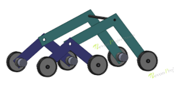

# Stair Climbing Wheelchair using Rocker-Bogie Mechanism

Academic mini project developed during B.Tech.

## Overview

This project demonstrates a prototype stair-climbing wheelchair using a rocker-bogie mechanism controlled using Arduino and Bluetooth.

The system was designed to help elderly and differently-abled individuals navigate stairs with minimal assistance.

---

## Features

- Rocker-bogie suspension mechanism
- Bluetooth-based wireless control
- Arduino UNO based control
- Servo motor wheel assembly
- Prototype stair climbing capability

---

## Components Used

- Arduino UNO
- HC-05 Bluetooth Module
- SG90 Servo Motors
- Rocker-Bogie Wheel Assembly

---

## Software Used

- Arduino IDE

---

## Mechanism

The prototype uses a rocker-bogie suspension mechanism inspired by rover mobility systems for improved traversal. It features six wheels on articulated arms that maintain constant ground contact, allowing the wheelchair to traverse uneven terrain, climb obstacles twice the wheel diameter, and keep the main body stable.

---

## Prototype Images

### Prototype Assembly


### Stair Climbing Test


### Rocker Bogie Mechanism



---

## Arduino Program

The Arduino code used for motor and Bluetooth control is included in:

```text
stair_climbing_wheelchair/stair_climbing_wheelchair.ino
```

---

## Documentation

Project report:

- Stair_Climbing_Wheelchair_Report.pdf

---

## Disclaimer

This project was developed for academic learning purposes and was inspired by publicly available educational robotics implementations and online resources.

---

## Authors

- Madineni Yuvaraj Ujwal
- Nandigama Apoorva
